COCO 이미지 데이터와 GAN과 PyTorch를 이용

## RGB vs LAB

RGB는
색상 데이터가 포함된 이미지는 (높이, 너비, 색상) 배열로 나타난다. 이 데이터는 RGB 색 공간에서 색상을 나타내며, 각 픽셀에 대해 3개의 숫자가 있어 픽셀의 크기를 나타낸다.

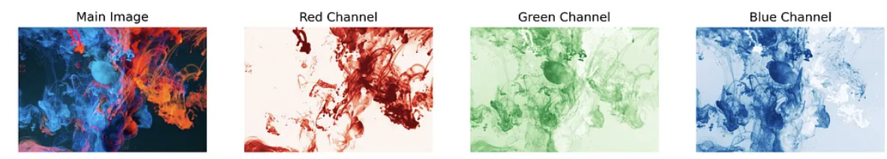

LAB는 화소마다 세 개의 숫자를 갖지만, 이 숫자들은 다른 의미를 가진다.
첫 번재 숫자 L은 각 화소의 '명도'를 나타낸다. L만을 이용해 시각화하면 흑백 이미지로 나타나게 된다.
A와 B 채널은 각 화소가 녹색-적색과 황색-청색인지를 나타낸다.

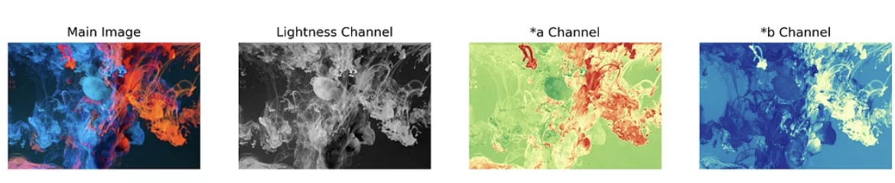

해당 프로젝트에서는 RGB가 아닌 LAB를 사용하여 모델을 훈련시킨다.
RGB를 이용하기 위해서는 먼저 이미지를 흑백 이미지로 변환하고, 세 가지의 조합을 이용해 학습해야하기에 LAB에 상대적으로 어렵게 된다.
즉 RGB는 256 3승의 경우를 예측해야한다.

프로젝트에서는 L1 회귀과 GAN을 사용한다.

해당 프로젝트에서는 흑백 스케일 이미지(L 채널)을 촬영하여 A채널과 B채널인 2채널 이미지를 생성한다.
그 후 Discriminator는 생성된 두 채널을 가져와 L채널과 연결하여 새로운 3채널의 이미지가 가짜인지 실제인지 결정한다. 


학습에 필요한 이미지는 [COCO 데이터 셋](https://cocodataset.org/#home)의 이미지를 사용한다.
1만여개의 이미지를 사용한다.
## 1.1 - Loading Image Paths
``` python
import …
  
paths = glob.glob("datasets/test2017/*.jpg") # COCO 데이터셋의 이미지들  
np.random.seed(123)
paths_subset = np.random.choice(paths, 10000, replace=False) # 무작위 10,000개의 이미지를 선택  
rand_idxs = np.random.permutation(10000) # 선택한 이미지들의 인덱스를 섞는다  
train_idxs = rand_idxs[:8000] # 80%는 학습 데이터로 사용  
val_idxs = rand_idxs[8000:] # 20%는 검증 데이터로 사용  
train_paths = paths_subset[train_idxs]  
val_paths = paths_subset[val_idxs]  
print(len(train_paths), len(val_paths))
```

```
8000 2000
```


## 1.2 - Making Datasets and DataLoaders
이후 데이터셋과 데이터로더를 생성한다.
``` python
# PyTorch를 사용하여 컬러 이미지의 L 채널을 흑백으로 변환하고,  
# 해당 이미지를 학습 및 검증을 위한 데이터로 처리하기 위한 데이터셋 및 데이터로더를 정의한다.  
  
SIZE = 256 # 이미지의 크기를 256x256으로 설정한다.  
  
class ColorizationDataset(Dataset):  
    def __init__(self, paths, split='train'):  
        if split == 'train': # 학습 데이터일 경우  
            self.transforms = transforms.Compose([  
                transforms.Resize((SIZE, SIZE), Image.BICUBIC), # 이미지의 크기를 256x256으로 설정한다.  
                transforms.RandomHorizontalFlip(),  # 무작위로 이미지를 수평으로 뒤집어 데이터 증강을 수행한다.  
            ])  
        elif split == 'val': # 검증 데이터일 경우  
            self.transforms = transforms.Resize((SIZE, SIZE), Image.BICUBIC) # 이미지의 크기를 256x256으로 설정한다.  
  
        self.split = split  
        self.size = SIZE  
        self.paths = paths  
  
    def __getitem__(self, idx):  
        img = Image.open(self.paths[idx]).convert("RGB") # 이미지를 RGB로 변환한다.  
        img = self.transforms(img)  
        img = np.array(img) # PIL 이미지를 Numpy 배열로 변환한다.  
        img_lab = rgb2lab(img).astype("float32")  # RGB 이미지를 L*a*b로 변환한다.  
        img_lab = transforms.ToTensor()(img_lab) # LAB 이미지를 PyTorch Tensor로 변환한다.  
        L = img_lab[[0], ...] / 50. - 1.  # L 채널을 -1에서 1로 정규화한다.  
        ab = img_lab[[1, 2], ...] / 110.  # A, B 채널을 -1에서 1로 정규화한다.  
  
        return {'L': L, 'ab': ab} # 딕셔너리 형태로 변환  
  
    def __len__(self):  
        return len(self.paths)

def make_dataloaders(batch_size=16, n_workers=4, pin_memory=True, **kwargs):  # 데이터로더를 생성하는 함수  
    dataset = ColorizationDataset(**kwargs) # 주어진 매개변수를 이용해 데이터셋을 생성한다.  
    dataloader = DataLoader(dataset, batch_size=batch_size, num_workers=n_workers,  
                            pin_memory=pin_memory) # 생성한 데이터셋으로 데이터로더를 생성한다.  
    return dataloader  
  
train_dl = make_dataloaders(paths=train_paths, split='train') # 학습 데이터셋에 대한 데이터로더  
val_dl = make_dataloaders(paths=val_paths, split='val') # 검증 데이터셋에 대한 데이터로더  
  
data = next(iter(train_dl)) # 첫 번째 미니배치  
Ls, abs_ = data['L'], data['ab'] # LAB 이미지의 L과 ABprint(Ls.shape, abs_.shape)  
print(len(train_dl), len(val_dl))
```

```
torch.Size([16, 1, 256, 256]) torch.Size([16, 2, 256, 256])
500 125
```


## 1.3 - Generator proposed by the paper (GAN)
GAN의 Generator로 사용될 U-Net을 구현한다. 이 부분에서 가장 중요한 것은 U-Net을 중간 부분에서 만들고, 입력 모듈과 출력 모듈에 도달할 때까지 반복할 때마다 중간 모듈의 왼쪽과 오른쪽에 다운 샘플링 및 업샘플링 모듈을 추가하는 것이다.

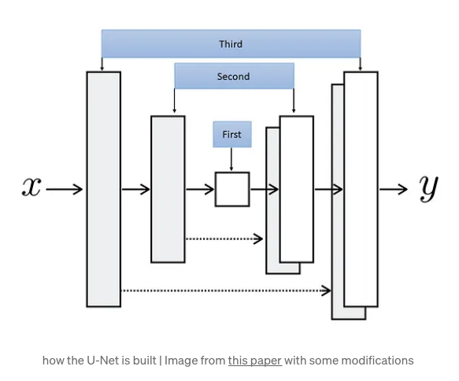

파란색 직사각형은 코드로 관련된 모듈을 구축하는 순서를 보여준다.
프로잭트 내 코드상에서 구현된 계층은 8계층으로 구현되어있다.
256x256 이미지로 시작하면 U-Net의 중간에서 1x1(256 / 2 8승) 이미지를 얻고 업샘플링하여 256x256 이미지 (2채널)을 생성한다.

``` python
# U-Net 구조에서 사용되는 각 블록을 정의하는 클래스  
class UnetBlock(nn.Module):  
    def __init__(self, nf, ni, submodule=None, input_c=None, dropout=False,  
                 innermost=False, outermost=False):  
        super().__init__()  
        self.outermost = outermost  
  
        # 입력 채널이 지정되지 않았다면 출력 채널(nf)를 사용  
        if input_c is None: input_c = nf  
  
        # 다운샘플링을 위한 Convolution 정의  
        downconv = nn.Conv2d(input_c, ni, kernel_size=4,  
                             stride=2, padding=1, bias=False)  
        downrelu = nn.LeakyReLU(0.2, True)  
        downnorm = nn.BatchNorm2d(ni)  
        uprelu = nn.ReLU(True)  
        upnorm = nn.BatchNorm2d(nf)  
  
        # outermost일 때는 업샘플링 후 Tanh 활성화 함수를 사용  
        if outermost:  
            upconv = nn.ConvTranspose2d(ni * 2, nf, kernel_size=4,  
                                        stride=2, padding=1)  
            down = [downconv]  
            up = [uprelu, upconv, nn.Tanh()]  
            model = down + [submodule] + up  
  
        # innermost일 때는 업샘플링 후 BatchNorm 사용  
        elif innermost:  
            upconv = nn.ConvTranspose2d(ni, nf, kernel_size=4,  
                                        stride=2, padding=1, bias=False)  
            down = [downrelu, downconv]  
            up = [uprelu, upconv, upnorm]  
            model = down + up  
  
        # 그 외의 경우에는 업샘플링 후 BatchNorm 및 Dropout(optional) 사용  
        else:  
            upconv = nn.ConvTranspose2d(ni * 2, nf, kernel_size=4,  
                                        stride=2, padding=1, bias=False)  
            down = [downrelu, downconv, downnorm]  
            up = [uprelu, upconv, upnorm]  
  
            # dropuot인 경우 Dropout 레이어 추가  
            if dropout: up += [nn.Dropout(0.5)]  
            model = down + [submodule] + up  
  
        # Sequential을 사용ㅇ하여 레이어를 순차적으로 적용  
        self.model = nn.Sequential(*model)  
  
    def forward(self, x):  
        # outermost일 때는 모델 전체를 반환  
        if self.outermost:  
            return self.model(x)  
        # 그 외에는 입력과 모델의 결과를 채널 방향으로 결합하여 반환  
        else:  
            return torch.cat([x, self.model(x)], 1)  
  
# U-Net 아키텍쳐를 정의하는 클래스  
class Unet(nn.Module):  
    def __init__(self, input_c=1, output_c=2, n_down=8, num_filters=64):  
        super().__init__()  
          
        # innermost 레이어를 만들기 위해 UnetBlock 클래스를 사용  
        unet_block = UnetBlock(num_filters * 8, num_filters * 8, innermost=True)  
          
        # n_down - 5 만큼의 다운샘플링 레이어를 생성  
        for _ in range(n_down - 5):  
            unet_block = UnetBlock(num_filters * 8, num_filters * 8, submodule=unet_block, dropout=True)  
        out_filters = num_filters * 8  
        # 3개의 업샘플링 레이어를 생성  
        for _ in range(3):  
            unet_block = UnetBlock(out_filters // 2, out_filters, submodule=unet_block)  
            out_filters //= 2  
            # outermost 레이어를 생성하여 전체 U-Net 아키텍쳐 생성  
        self.model = UnetBlock(output_c, out_filters, input_c=input_c, submodule=unet_block, outermost=True)  
  
    def forward(self, x):  
        return self.model(x)
```

## 1.4 - Discriminator
이 코드는 Conv-BatchNorm-LackyReLU의 블록을 사용해 입력된 이미지가 가짜인지 실제인지 결정함으로써 모델을 구현한다.
첫 번재와 마지막 블록은 정규화를 하지 않으며 마지막 블록은 활성화 함수가 없다.

``` python
# PatchGan Discriminator를 정의하는 클래스  
class PatchDiscriminator(nn.Module):  
    def __init__(self, input_c, num_filters=64, n_down=3):  
        super().__init__()  
  
        model = [self.get_layers(input_c, num_filters, norm=False)] # Discriminator 모델을 정의하기 위한 리스트  
  
        # 다운샘플링 레이어를 추가  
        model += [self.get_layers(num_filters * 2 ** i, num_filters * 2 ** (i + 1), s=1 if i == (n_down-1) else 2)  
                          for i in range(n_down)]  
        model += [self.get_layers(num_filters * 2 ** n_down, 1, s=1, norm=False, act=False)] # 마지막 레이어 추가 (Normalization 및 Activation을 사용하지 않음)  
  
        self.model = nn.Sequential(*model) # Sequential을 이용하여 Discriminator 모델 정의  
  
    # Discriminator에서 사용되는 Convolutional 레이어를 생성하는 메서드  
    def get_layers(self, ni, nf, k=4, s=2, p=1, norm=True, act=True):  
        layers = [nn.Conv2d(ni, nf, k, s, p, bias=not norm)] # Convolutional 레이어 추가  
        if norm: layers += [nn.BatchNorm2d(nf)] # Batch Normalization 레이어 추가  
        if act: layers += [nn.LeakyReLU(0.2, True)] # Leaky ReLU Activation 레이어 추가  
        return nn.Sequential(*layers)  
  
    def forward(self, x):  
        return self.model(x)
```

``` python
print(PatchDiscriminator(input_c=3))
>>>
PatchDiscriminator(
  (model): Sequential(
    (0): Sequential(
      (0): Conv2d(3, 64, kernel_size=(4, 4), stride=(2, 2), padding=(1, 1))
      (1): LeakyReLU(negative_slope=0.2, inplace=True)
    )
    (1): Sequential(
      (0): Conv2d(64, 128, kernel_size=(4, 4), stride=(2, 2), padding=(1, 1), bias=False)
      (1): BatchNorm2d(128, eps=1e-05, momentum=0.1, affine=True, track_running_stats=True)
      (2): LeakyReLU(negative_slope=0.2, inplace=True)
    )
    (2): Sequential(
      (0): Conv2d(128, 256, kernel_size=(4, 4), stride=(2, 2), padding=(1, 1), bias=False)
      (1): BatchNorm2d(256, eps=1e-05, momentum=0.1, affine=True, track_running_stats=True)
      (2): LeakyReLU(negative_slope=0.2, inplace=True)
    )
    (3): Sequential(
      (0): Conv2d(256, 512, kernel_size=(4, 4), stride=(1, 1), padding=(1, 1), bias=False)
      (1): BatchNorm2d(512, eps=1e-05, momentum=0.1, affine=True, track_running_stats=True)
      (2): LeakyReLU(negative_slope=0.2, inplace=True)
    )
    (4): Sequential(
      (0): Conv2d(512, 1, kernel_size=(4, 4), stride=(1, 1), padding=(1, 1))
    )
  )
)
```

Patach Discriminator
모델은 입력된 이미지 전체가 진짜 혹은 가짜라고 생각하는 정도를 나타내는 숫자(스케일러)를 출력한다. 패치 Discriminator에서 모델은 입력된 이미지의 70x70 픽셀이라고 말할 수 있는 패치마다 하나의 숫자를 출력하고, 각각의 패치가 가짜인지 아닌지를 개별적으로 결정한다.
이러한 모델을 색상화 작업에 사용하는 것은 모델이 변경해야 할 로컬 변경 사항이 매우 중요하기 때문에 전체 이미지를 결정하는 것은 이 작업의 세부 사항을 처리할 수 없기 때문이다.
여기서 모델의 출력 모양은 30x30 이지만 실제 패치 크기는 이 30x30의 출력 번호 각각의 수신 필드를 계산할 때 얻어지는데 이 경우에는 70x70이 된다.
``` python
discriminator = PatchDiscriminator(3) # PatchGAN Discriminator 인스턴스 생성  
dummy_input = torch.randn(16, 3, 256, 256) # batch_size, channels, size, size (더미 입력 데이터 샘플 16개, 채널 3개, 256x256 크기)  
out = discriminator(dummy_input) # 모델에 더미 입력을 전달하여 출력 계산  
out.shape
```

## 1.5 - GAN Loss
최종 모델의 GAN loss을 계산하는 데 사용할 수 있는 클래스이다.
어떤 종류의 loss을 사용할지를 결정하고, 일정한 텐서를 진짜 혹은 가짜 레이블로 등록한다.
이 모듈을 호출하면 0 또는 1로 가득찬 적절한 텐서를 만들고 loss을 계산한다.
``` python
# GAN loss을 정의하는 클래스  
class GANLoss(nn.Module):  
    def __init__(self, gan_mode='vanilla', real_label=1.0, fake_label=0.0):  
        super().__init__()  
  
        # 실제 및 가짜 레이블을 버퍼로 등록  
        self.register_buffer('real_label', torch.tensor(real_label))  
        self.register_buffer('fake_label', torch.tensor(fake_label))  
  
        # GAN 모드에 따라 loss 함수 선택  
        if gan_mode == 'vanilla':  
            self.loss = nn.BCEWithLogitsLoss() # 이진 교차 엔트로피 loss  
        elif gan_mode == 'lsgan':  
            self.loss = nn.MSELoss() # 평균 제곱 오차 loss  
  
    # 실제 또는 가짜 레이블을 반환하는 메서드  
    def get_labels(self, preds, target_is_real):  
        if target_is_real:  
            labels = self.real_label  
        else:  
            labels = self.fake_label  
        return labels.expand_as(preds)  
  
    # GAN loss을 계산하여 반환하는 메서드  
    def __call__(self, preds, target_is_real):  
        labels = self.get_labels(preds, target_is_real)  
        loss = self.loss(preds, labels)  
        return loss
```

## 

init에서는 이전에 정의한 함수와 클래스를 사용하여 Generator와 Discriminator를 정의하고 두 loss 함수와 Generator와 Discriminator의 최적화기를 정의한다.

전체 작업은 이 클래스의 최적화 방법으로 수행되고 있다. 먼저 반복당 한 번씩 모듈의 순방향 방법을 호출하고 출력을 클래스의 fake_color 변수에 저장한다.
그런 다음 Generator에서 생성된 가짜 이미지를 Generator의 그래프에서 분리하여 일반 이미지와 같이 Discriminator에 공급하고 가짜로 레이블을 지정하는 backward_D 방법을 사용하여 Discriminator를 훈련시킨다.
그런 다음 훈련 세트의 실제 이미지를 Discriminator에 공급하고 실제로 레이블을 지정한다.
가짜와 진짜의 두 loss을 합산하고 평균을 취한 다음 최종 loss에 대해 거꾸로 호출한다.

backward_G 방법에서는 Discriminator에게 가짜 이미지를 제공하고 실제 레이블을 할당하여 적대적 loss을 계산하여 속이려고 한다. L1 loss도 사용하여 예측된 두 채널과 대상 두 채널 사이의 거리를 계산하고 이 loss에 계수를 곱하여 두 loss의 균형을 맞춘다.

``` python
class MainModel(nn.Module):  
    def __init__(self, net_G=None, lr_G=2e-4, lr_D=2e-4,  
                 beta1=0.5, beta2=0.999, lambda_L1=100.):  
        super().__init__()  
  
        # macOS M1 프로세스를 사용할 때 GPU를 쓰기 위한 코드  
        self.device = torch.device("mps:0" if torch.backends.mps.is_available() else "cpu")  
          
        # lambda_L1은 L1 loss 가중치  
        self.lambda_L1 = lambda_L1  
  
        # Generator 및 Discriminator 모델 초기화  
        if net_G is None:  
            self.net_G = init_model(Unet(input_c=1, output_c=2, n_down=8, num_filters=64), self.device)  
        else:  
            self.net_G = net_G.to(self.device)  
              
        self.net_D = init_model(PatchDiscriminator(input_c=3, n_down=3, num_filters=64), self.device)  
          
        # GAN 및 L1 loss 함수 초기화  
        self.GANcriterion = GANLoss(gan_mode='vanilla').to(self.device)  
        self.L1criterion = nn.L1Loss()  
          
        # Generator 및 Discriminator의 최적화를 위한 Adam 옵티마이저 초기화  
        self.opt_G = optim.Adam(self.net_G.parameters(), lr=lr_G, betas=(beta1, beta2))  
        self.opt_D = optim.Adam(self.net_D.parameters(), lr=lr_D, betas=(beta1, beta2))  
  
    # 모델의 파라미터에 대해 requires_grad를 설정하는 메서드  
    def set_requires_grad(self, model, requires_grad=True):  
        for p in model.parameters():  
            p.requires_grad = requires_grad  
  
    # 입력 데이터를 설정하는 메서드  
    def setup_input(self, data):  
        self.L = data['L'].to(self.device)  
        self.ab = data['ab'].to(self.device)  
  
    def forward(self):  
        self.fake_color = self.net_G(self.L)  
  
    # Discriminator를 역전파하여 loss 계산하는 메서드  
    def backward_D(self):  
        fake_image = torch.cat([self.L, self.fake_color], dim=1)  
        fake_preds = self.net_D(fake_image.detach())  
        self.loss_D_fake = self.GANcriterion(fake_preds, False)  
        real_image = torch.cat([self.L, self.ab], dim=1)  
        real_preds = self.net_D(real_image)  
        self.loss_D_real = self.GANcriterion(real_preds, True)  
        self.loss_D = (self.loss_D_fake + self.loss_D_real) * 0.5  
        self.loss_D.backward()  
  
    # Generator를 역전파하여 GAN 및 L1 loss 계산하는 메서드   
def backward_G(self):  
        fake_image = torch.cat([self.L, self.fake_color], dim=1)  
        fake_preds = self.net_D(fake_image)  
        self.loss_G_GAN = self.GANcriterion(fake_preds, True)  
        self.loss_G_L1 = self.L1criterion(self.fake_color, self.ab) * self.lambda_L1  
        self.loss_G = self.loss_G_GAN + self.loss_G_L1  
        self.loss_G.backward()  
  
    # 최적화를 수행하는 메서드  
    def optimize(self):  
        self.forward()  
          
        # Discriminator 업데이트  
        self.net_D.train()  
        self.set_requires_grad(self.net_D, True)  
        self.opt_D.zero_grad()  
        self.backward_D()  
        self.opt_D.step()  
  
        # Generator 업데이트  
        self.net_G.train()  
        self.set_requires_grad(self.net_D, False)  
        self.opt_G.zero_grad()  
        self.backward_G()  
        self.opt_G.step()  
  
model = MainModel()
```

## 1.7 - Utility functions
시각화, loss 출력 등의 함수
``` python
class AverageMeter:  
    def __init__(self):  
        self.reset()  
  
    def reset(self):  
        self.count, self.avg, self.sum = [0.] * 3  
  
    def update(self, val, count=1):  
        # 주어진 값(val)과 개수(count)를 사용하여 미터로 업데이트하는 메서드  
        self.count += count  
        self.sum += count * val  
        self.avg = self.sum / self.count  
  
def create_loss_meters():  
    # 여러 loss을 기록하기 위한 AverageMeter 객체들을 생성하는 함수  
    # 각 loss 유형에 대한 AverageMeter 객체를 생성하고 이들을 딕셔너리로 반환  
  
    loss_D_fake = AverageMeter() # 가짜 데이터에 대한 Discriminator loss    loss_D_real = AverageMeter() # 진짜 데이터에 대한 Discriminator loss    loss_D = AverageMeter() # 전체 Discriminator loss    loss_G_GAN = AverageMeter() # Generator의 GAN loss    loss_G_L1 = AverageMeter() # Generator의 L1 loss    loss_G = AverageMeter() # 전체 Generator loss  
    return {'loss_D_fake': loss_D_fake,  
            'loss_D_real': loss_D_real,  
            'loss_D': loss_D,  
            'loss_G_GAN': loss_G_GAN,  
            'loss_G_L1': loss_G_L1,  
            'loss_G': loss_G}  
  
def update_losses(model, loss_meter_dict, count):  
    """  
	여러 loss을 기록하기 위한 AverageMeter 객체들을 생성하는 함수  
	:return: 각 loss 유형에 대한 AverageMeter 객체를 생성하고 이들을 딕셔너리로 반환  
	"""
    for loss_name, loss_meter in loss_meter_dict.items():  
        loss = getattr(model, loss_name) # 모델에서 해당 loss 유형에 대한 loss 값을 가져옴  
        loss_meter.update(loss.item(), count=count) # AverageMeter 업데이트 (count는 배치 크기)  
  
def lab_to_rgb(L, ab):  
    """  
    LAB에서 RGB로 변환하는 함수  
    :param L: L 채널(명도) 정보를 포함하는 Tensor    :param ab: ab 채널(색상) 정보를 포함하는 Tensor    :return: RGB 이미지로 변환된 Numpy 배열  
    """  
    # L, AB 채널을 원래 범위로 되돌리고 Tensor를 Numpy 배열로 반환  
    L = (L + 1.) * 50.  
    ab = ab * 110.  
    Lab = torch.cat([L, ab], dim=1).permute(0, 2, 3, 1).cpu().numpy() # GPU <-> CPU 변경????????????????  
  
    # 각 이미지에 대해서 LAB에서 RGB로 변경  
    rgb_imgs = []  
    for img in Lab:  
        img_rgb = lab2rgb(img)  
        rgb_imgs.append(img_rgb)  
    return np.stack(rgb_imgs, axis=0) # Numpy 배열로 스택하여 반환  
  
def visualize(model, data, save=True):  
    """  
    모델의 출력을 시각화하는 함수  
    :param model: 시각화할 모델  
    :param data: 시각화할 데이터  
    :param save: 이미지를 저장할지 여부를 결정하는 플래그  
    :return:   
    """  
    # Generator 네트워크를 평가 모드로 설정하고, 입력 데이터를 이용  
    model.net_G.eval()  
    with torch.no_grad():  
        model.setup_input(data)  
        model.forward()  
    model.net_G.train()  
      
    # 생성된 가짜 컬러 이미지와 실제 컬러 이미지를 가져옴  
    fake_color = model.fake_color.detach()  
    real_color = model.ab  
    L = model.L  
      
    # LAB에서 RGB로 이미지 변환  
    fake_imgs = lab_to_rgb(L, fake_color)  
    real_imgs = lab_to_rgb(L, real_color)  
      
    fig = plt.figure(figsize=(15, 8)) # 시각화를 위한 Matplotlib 플롯 설정  
    # 첫 5개의 샘플에 대해 각각 원본 L 채널, 생성된 컬러 이미지, 실제 컬러 이미지를 플롯  
    for i in range(5):  
        ax = plt.subplot(3, 5, i + 1)  
        ax.imshow(L[i][0].cpu(), cmap='gray') # 원본 L 채널  
        ax.axis("off")  
          
        ax = plt.subplot(3, 5, i + 1 + 5)  
        ax.imshow(fake_imgs[i]) # 생성된 컬러 이미지  
        ax.axis("off")  
          
        ax = plt.subplot(3, 5, i + 1 + 10)  
        ax.imshow(real_imgs[i]) # 실제 컬러 이미지  
        ax.axis("off")  
    plt.show()  
      
    if save: # save 플래그가 True인 경우 이미지를 파일로 저장  
        fig.savefig(f"colorization_{time.time()}.png")  
  
def log_results(loss_meter_dict): # 로그  
    for loss_name, loss_meter in loss_meter_dict.items():  
        print(f"{loss_name}: {loss_meter.avg:.5f}")
```


## 1.8 - Training function

``` python
def train_model(model, train_dl, epochs, display_every=200):  
    data = next(iter(val_dl)) # Validation 데이터로부터 시각화용 배치를 얻음  
    for e in range(epochs):  
        loss_meter_dict = create_loss_meters() # loss을 기록하기 위한 미터 객체들을 초기화  
        i = 0 # 반복 횟수  
        for data in tqdm(train_dl): # 훈련 데이터 로더에서 미니배치를 순회  
            model.setup_input(data) # 모델 입력 데이터 설정  
            model.optimize() # 모델 최적화  
            update_losses(model, loss_meter_dict, count=data['L'].size(0)) # loss 업데이트  
            i += 1  
            if i % display_every == 0: # 주어진 주기마다 loss과 모델 출력을 표시  
                print(f"\nEpoch {e+1}/{epochs}")  
                print(f"Iteration {i}/{len(train_dl)}")  
                log_results(loss_meter_dict) # 현재까지의 loss을 출력  
                visualize(model, data, save=False) # 모델의 출력을 시각화  
  
train_model(model, train_dl, 100) # 모델 훈련 함수 호출
```

# 결과

``` python
import PIL  
  
model = MainModel()  
# device = torch.device('cuda' if torch.cuda.is_available() else 'cpu')  
device = torch.device("mps:0" if torch.backends.mps.is_available() else "cpu")  
model.load_state_dict(  
    torch.load(  
        "trained_model.pth",  
        map_location=device  
    )  
)  
path = "blackwhite.jpg"  
img = PIL.Image.open(path)  
img = img.resize((256, 256))  
# to make it between -1 and 1  
img = transforms.ToTensor()(img)[:1] * 2. - 1.  
model.eval()  
with torch.no_grad():  
    preds = model.net_G(img.unsqueeze(0).to(device))  
colorized = lab_to_rgb(img.unsqueeze(0), preds.cpu())[0]  
plt.imshow(colorized)
```
<br>

# 성능

학습을 진행한 하드웨어 스펙
```
CPU: Apple M1 Pro
GPU: Apple M1 Pro
RAM: 16GB
OS: macOS sonoma 14.0
Tool: PyCharm
Python: 3.11
...
```

<br>

**1회차: (약 15시간 학습)**
epochs: 100
Generator Learning Rate: 0.1
Discriminator Learning Rate: 0.1
beta1(First Adam Momentum): 0.5
beta2(Second Adam Momentum): 0.999
```
loss_D_fake: 3.10806
loss_D_real: 2.09929
loss_D: 2.60368
loss_G_GAN: 4.85083
loss_G_L1: 96.86528
loss_G: 101.71611
```

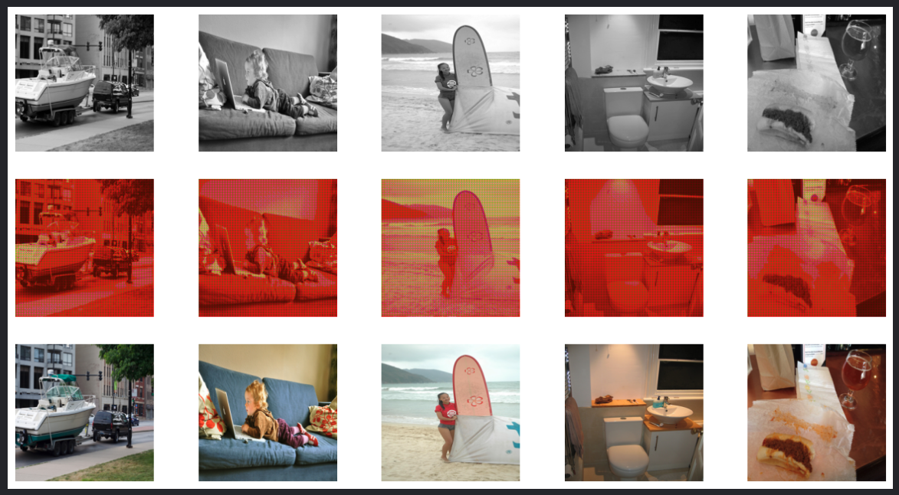

<br>

**2회차: Learning Rate 변경 (약 7시간 학습 중에 중단)**
epochs: 100
Generator Learning Rate: 0.2
Discriminator Learning Rate: 0.2
beta1(First Adam Momentum): 0.5
beta2(Second Adam Momentum): 0.999
```
loss_D_fake: 9.46125
loss_D_real: 6.98206
loss_D: 8.22165
loss_G_GAN: 8.33871
loss_G_L1: 98.32729
loss_G: 106.66600
```

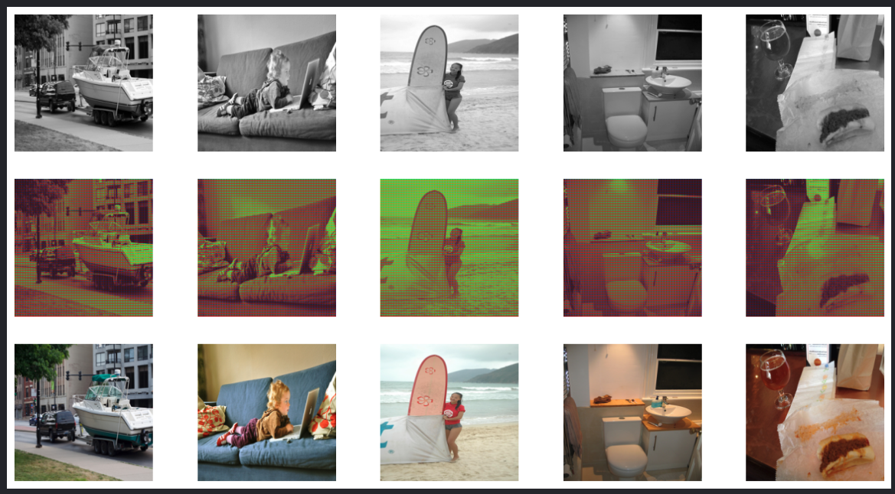

<br>

**3회차: beta1(First Adam Momentum) 변경 (약 4시간 학습 중에 중단)**
epochs: 100
Generator Learning Rate: 2e-4
Discriminator Learning Rate: 2e-4
beta1(First Adam Momentum): 0.9
beta2(Second Adam Momentum): 0.999

```
loss_D_fake: 8.20684
loss_D_real: 4.28471
loss_D: 6.24577
loss_G_GAN: 12.26074
loss_G_L1: 99.17970
loss_G: 111.44044
```

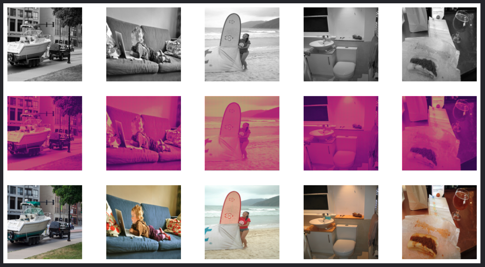

<br>

**4회차: Learning Late 값 변경 (약 17시간 학습)**
epochs: 100
Generator Learning Rate: 2e-4
Discriminator Learning Rate: 2e-4
beta1(First Adam Momentum): 0.5
beta2(Second Adam Momentum): 0.999
```
loss_D_fake: 0.44464
loss_D_real: 0.43065
loss_D: 0.43764
loss_G_GAN: 1.85933
loss_G_L1: 4.99254
loss_G: 6.85187
```

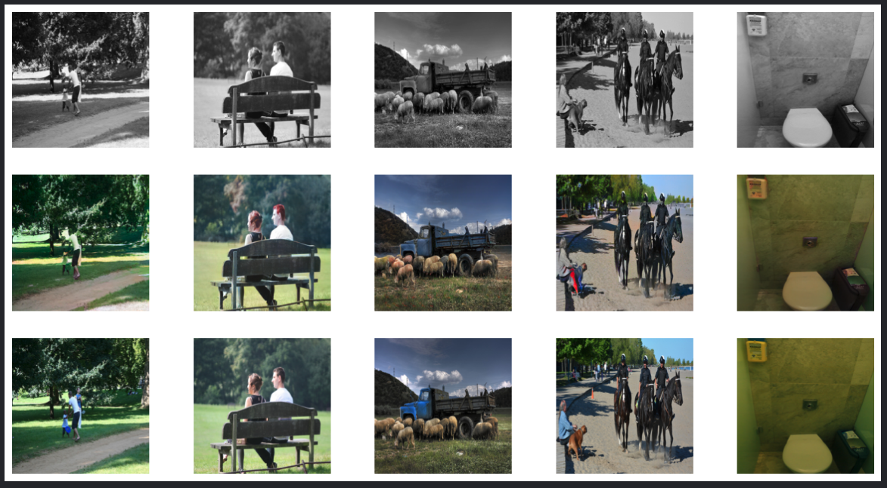

<br>

**5회차: epochs 값 변경 (약 10시간 학습)**
epochs: 50
Generator Learning Rate: 2e-4
Discriminator Learning Rate: 2e-4
beta1(First Adam Momentum): 0.5
beta2(Second Adam Momentum): 0.999

```
loss_D_fake: 0.50381
loss_D_real: 0.49753
loss_D: 0.50067
loss_G_GAN: 1.48165
loss_G_L1: 6.23062
loss_G: 7.71227
```

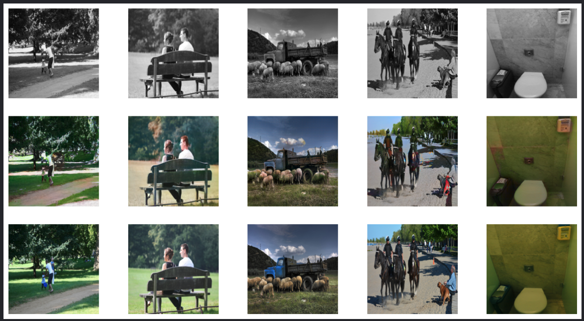

<hr>

결과


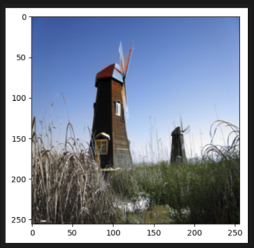


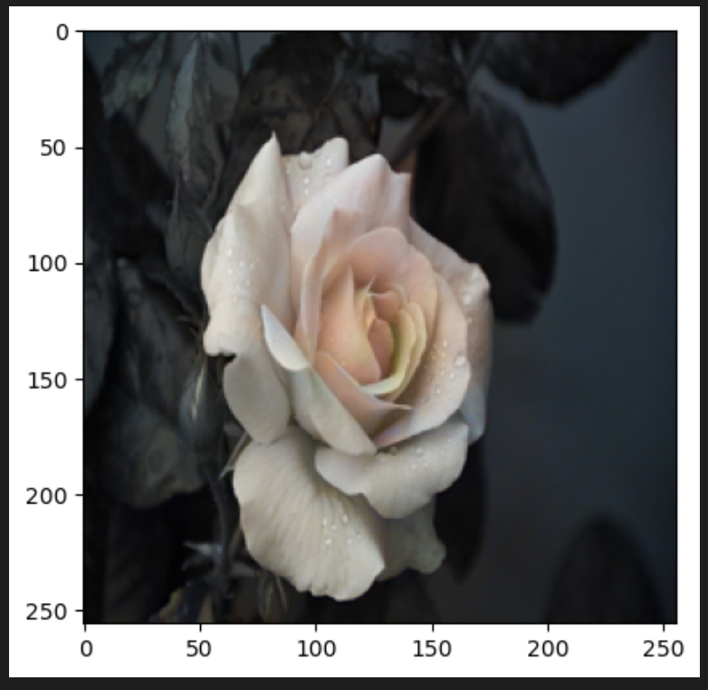


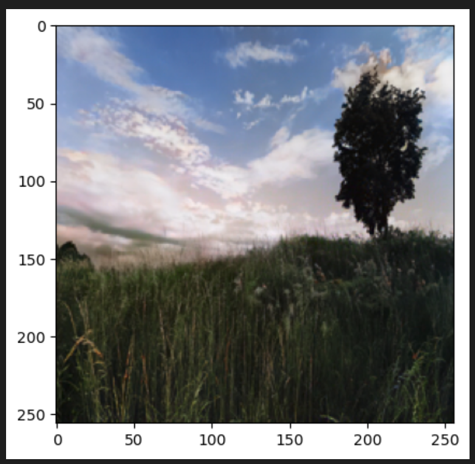

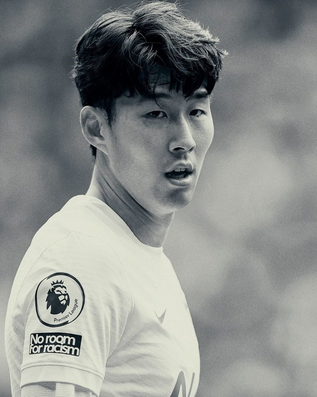

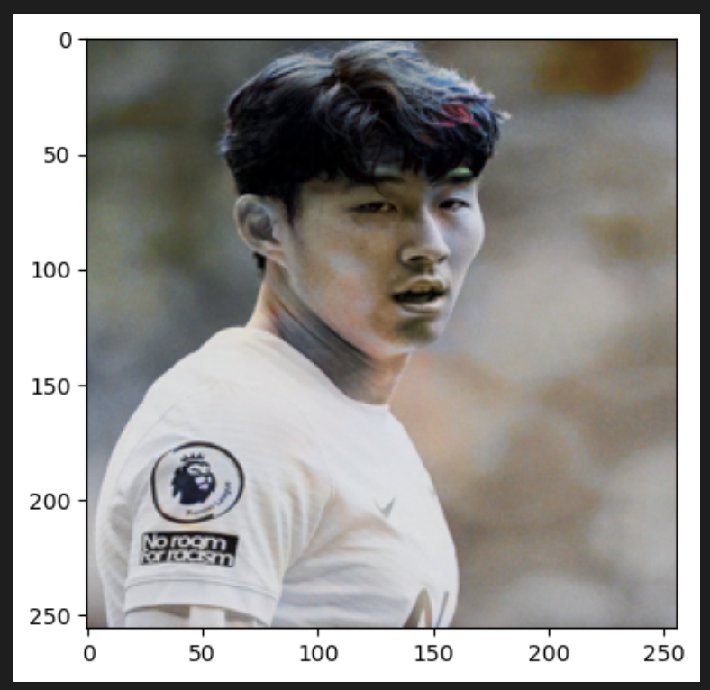

머신러닝에 대해 프로젝트를 진행할 수 있을까라는 막막함이 앞섰던 프로젝트였다. 마지막 머신러닝 14주차 강의 때 GAN에 대해 수강을 하고, 흥미가 생겨 GAN을 이용한 프로젝트를 진행해 보았으면 했다.
논문과 각종 자료들을 참고하여 모델을 구현 및 사용하였는데, 대부분 코드를 해석하느라 시간을 보낸 것 같았다. 하이퍼 파라미터 값들을 변경하면서 보다 좋은 학습을 할 수 있도록 하고 싶었지만, 값을 변경함에따라 결과과 굉장히 많이 변경되는 것을 알게 되었고, 머신러닝에 대해 새로운 지식을 습득한 것 같다는 느낌을 받은 프로젝트였다.
Apple M1 Pro 프로세서를 사용하여 학습을 진행하다보니 학습 시간이 굉장히 오래걸렸는데, 데스크탑으로 학습을 진행해보고자 한다. 또한 1만개의 이미지 데이터를 가지고 학습이 아닌 더 많은 데이터들을 가지고 학습을 하게 되면 어떤 변화가 나타날지 또한 궁금하여 데이터의 수를 조절해가며 학습을 진행할 예정이다.
